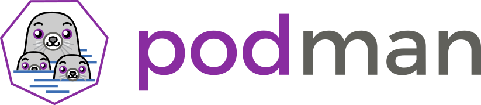

# Обзор Podman

## Что такое Podman?

Podman - это инструмент управления контейнерами с открытым исходным кодом, предоставляющий решение для управления контейнерами на системах Linux без использования демона. В отличие от традиционных сред выполнения контейнеров, Podman не требует центрального демона, что делает его легким и более безопасным.

## Основные фичи

### 1. Архитектура без демона

#### Что такое демон?

Демон (или демон-процесс) в контексте контейнеризации - это фоновый процесс, который запускается на хост-системе и отвечает за управление и выполнение контейнеров. Docker, например, использует демона для обработки запросов от командной строки, управления жизненным циклом контейнеров и взаимодействия с образами.

#### Сравнение с Docker

Podman разрабатывался как альтернатива Docker, и его архитектура без демона предлагает несколько преимуществ:

##### Podman:

- **Отсутствие центрального демона:** Podman не требует постоянно работающего фонового процесса. Это уменьшает атаковую поверхность и снижает риски безопасности, связанные с возможными уязвимостями в демоне.

- **Легковесность:** Поскольку Podman не использует постоянно запущенный демон, он требует меньше ресурсов и обеспечивает быстрый старт контейнеров.

- **Прозрачная интеграция с системой:** Podman обеспечивает нативную интеграцию с инструментами управления системой, такими как systemd, что упрощает работу в средах с systemd.

##### Docker:

- **Центральный демон:** Docker использует демон для обработки команд пользователя и управления жизненным циклом контейнеров. Это обеспечивает единый точку управления, но может создавать риски безопасности.

- **Больше ресурсов:** Запуск постоянно работающего демона может требовать больше ресурсов системы, особенно на машинах с ограниченными ресурсами.

### Примеры использования

#### Запуск контейнера с Podman:

```bash
podman run -d -p 8080:80 nginx
```

#### Запуск контейнера с Docker:

```bash
docker run -d -p 8080:80 nginx
```

В обоих случаях контейнер с веб-сервером [Nginx](https://nginx.org/) будет запущен на фоне, но подходы к управлению контейнерами и фоновыми процессами различны. Podman не требует наличия постоянно работающего демона, в то время как Docker зависит от демона для выполнения подобных операций.
Также можно регламентировать запуск контейнера с помощью к примеру [GitHub Actions](https://github.com/features/actions) и терминальной утилиты [Cron](https://habr.com/ru/companies/badoo/articles/468061/).

### 2. Контейнеры без привилегий

С Podman пользователи могут запускать контейнеры от имени пользователя без прав администратора, что обеспечивает дополнительный уровень безопасности. Это особенно полезно в средах, где выполнение контейнеров от имени пользователя без привилегий является лучшей практикой безопасности.
1. Запустите контейнер с Podman, указав конкретного пользователя:

    ```bash
    podman run --rm -it --user 1000 alpine sh
    ```

    Где "1000" - это UID непривилегированного пользователя.

2. Внутри контейнера выполните команду, чтобы узнать текущего пользователя:

    ```bash
    whoami
    ```
Аналогично для Docker...

### 3. Поддержка Pod

#### Что такое Pod?

Pod - это группа контейнеров, разделяющих общее пространство сети и устройство IPC. Pod предоставляет более высокий уровень абстракции для управления и развертывания множества контейнеров как единого приложения.

#### Поддержка Pod в Podman

Podman предоставляет поддержку Pod, что позволяет вам создавать и управлять группами контейнеров, работающих в общем контексте. Каждый контейнер в поде имеет свой собственный namespace процессов и файловой системы, но они все могут взаимодействовать друг с другом внутри общего namespace сети и IPC.

#### Пример создания Pod с Podman:

```bash
# Создание пода
podman pod create --name mypod

# Запуск контейнеров в поде
podman run -dt --pod mypod nginx
podman run -dt --pod mypod alpine

# Присоединение к контейнеру в поде
podman exec -it <container_id_or_name> sh
```

#### Сравнение с Docker:

##### Docker:

- Docker также поддерживает концепцию Pod, но в его терминологии это называется "сеть сервисов" (Service Network). Поддержка Pod в Docker появилась относительно недавно, и она ограничена на определенных операционных системах (например, Linux с определенными ядрами).

- В Docker, для создания Pod, вы можете использовать команды `docker-compose` или `docker stack`, предоставляющие средства для создания и управления группами контейнеров. Однако, поддержка Pod в Docker не настолько интегрирована, как в Podman.

##### Podman:

- Podman предоставляет интуитивный и простой интерфейс для создания и управления подами без необходимости использования дополнительных инструментов, таких как `docker-compose`.

- Поддержка Pod в Podman является более интегрированной, и контейнеры внутри пода могут взаимодействовать с другими с тем же уровнем удобства, что и при использовании обычных контейнеров.

Общим для обоих инструментов является стремление предоставить удобные средства для управления группами контейнеров и их взаимодействия в рамках общего контекста. Однако Podman позиционируется как легковесная и бездемонная альтернатива Docker, предлагающая поддержку Pod в интуитивной форме.

### 4. Совместимость с Docker

Podman совместим с образами контейнеров Docker и может без проблем запускать контейнеры, созданные с использованием Docker, что упрощает переход от Docker к Podman.

### 5. Интеграция с Buildah

#### Что такое Buildah?

Buildah - это инструмент с открытым исходным кодом, предназначенный для создания образов контейнеров. В отличие от традиционных инструментов сборки образов, таких как Docker, Buildah не требует наличия демона и может использоваться для сборки образов в непривилегированных средах.

#### Интеграция Buildah с Podman

Podman интегрирован с Buildah, предоставляя пользователям единое решение для управления контейнерами и создания образов. Эта интеграция упрощает процесс сборки образов, поскольку пользователи могут использовать одну утилиту (Buildah) для создания образов и другую (Podman) для их запуска и управления.

#### Преимущества интеграции:

#### 1. Легкость использования:

Пользователи могут использовать одни и те же команды для сборки образов и работы с контейнерами, что делает процесс разработки и развертывания более единообразным и легким.

#### 2. Бездемонная архитектура:

Как и Podman, Buildah работает в бездемонном режиме, что уменьшает сложность и риски, связанные с постоянно работающим демоном контейнеров.

#### 3. Использование в непривилегированных средах:

Buildah может использоваться для сборки образов в непривилегированных средах, что повышает безопасность и упрощает интеграцию с CI/CD системами.

#### Примеры использования:

##### 1. Сборка образа с Buildah:

```bash
buildah bud -t myimage .
```

##### 2. Запуск контейнера с Podman:

```bash
podman run -d myimage
```

##### 3. Совместное использование Buildah и Podman:

```bash
# Сборка образа с Buildah
buildah bud -t myimage .

# Запуск контейнера с Podman, используя собранный образ
podman run -d myimage
```

#### Сравнение с Docker:

##### Buildah + Podman:

- Бездемонная архитектура: Как Buildah, так и Podman работают в режиме без демона, что улучшает безопасность и управляемость.

- Интеграция команд: Пользователи могут использовать одни и те же команды (например, `buildah bud` и `podman run`) для различных этапов разработки и развертывания.

##### Docker:

- Docker Build: В Docker для сборки образов используется команда `docker build`. Традиционный Docker CLI также используется для запуска и управления контейнерами.

- Демон: Docker использует постоянно работающий демон для управления контейнерами и образами, что может создавать дополнительные сложности и риски безопасности.

Интеграция Buildah с Podman предоставляет пользователям гибкое и безопасное решение для создания и управления контейнерами в современных окружениях разработки и развертывания.

## Начало работы

### Установка Podman и Buildah

#### На Linux (Debian/Ubuntu):

1. Установка Podman:

    ```bash
    sudo apt-get update
    sudo apt-get install -y podman
    ```

2. Установка Buildah:

    ```bash
    sudo apt-get install -y buildah
    ```

#### На Linux (Fedora):

1. Установка Podman:

    ```bash
    sudo dnf install -y podman
    ```

2. Установка Buildah:

    ```bash
    sudo dnf install -y buildah
    ```

#### На Linux (CentOS/RHEL):

1. Установка EPEL-репозитория (требуется для CentOS/RHEL):

    ```bash
    sudo yum install -y epel-release
    ```

2. Установка Podman:

    ```bash
    sudo yum install -y podman
    ```

3. Установка Buildah:

    ```bash
    sudo yum install -y buildah
    ```

#### На MacOS:

1. Установка Homebrew (если ещё не установлено):

    ```bash
    /bin/bash -c "$(curl -fsSL https://raw.githubusercontent.com/Homebrew/install/HEAD/install.sh)"
    ```

2. Установка Podman:

    ```bash
    brew install podman
    ```

3. Установка Buildah:

    ```bash
    brew install buildah
    ```

### Настройка Podman

#### Настройка для использования непривилегированным пользователем:

1. Создание группы `podman`:

    ```bash
    sudo groupadd podman
    ```

2. Добавление текущего пользователя в группу `podman`:

    ```bash
    sudo usermod -aG podman $USER
    ```

3. Перезапуск сессии пользователя или выход/вход в систему.

### Проверка установки:

```bash
podman --version
buildah --version
```

Если установка выполнена успешно, вы должны увидеть версии Podman и Buildah.

Теперь у вас установлены и настроены Podman и Buildah для работы с контейнерами. Вы можете использовать эти инструменты для создания, управления и сборки образов контейнеров в бездемонном режиме.

## Основные команды

### 1. Запуск контейнера с Podman

```bash
podman run -it --rm alpine sh
```

- `-it`: Открывает интерактивную оболочку внутри контейнера.
- `--rm`: Удаляет контейнер после завершения выполнения команды.
- `alpine`: Имя образа, который вы хотите использовать.
- `sh`: Команда, которую вы хотите выполнить внутри контейнера (в данном случае, оболочка `sh`).

### 2. Просмотр запущенных контейнеров

```bash
podman ps
```

Эта команда покажет список запущенных контейнеров.

### 3. Просмотр всех контейнеров (включая остановленные)

```bash
podman ps -a
```

Эта команда покажет список всех контейнеров, включая остановленные.

### 4. Построение образа с Buildah

```bash
buildah bud -t myimage .
```

- `-t myimage`: Устанавливает тег образа как "myimage".
- `.`: Путь к контексту сборки (например, текущая директория).

### 5. Запуск контейнера с использованием собранного образа

```bash
podman run -d myimage
```

- `-d`: Запускает контейнер в фоновом режиме.

### 6. Список сетей Podman

```bash
podman network ls
```

Эта команда покажет список созданных сетей Podman.

### 7. Создание новой сети Podman

```bash
podman network create mynetwork
```

Эта команда создаст новую сеть с именем "mynetwork".

### 8. Присоединение контейнера к сети

```bash
podman network connect mynetwork container_name_or_id
```

Эта команда присоединит контейнер к сети "mynetwork".

### 9. Просмотр логов контейнера

```bash
podman logs container_name_or_id
```

Эта команда покажет журналы вывода контейнера.

### 10. Остановка контейнера

```bash
podman stop container_name_or_id
```

Эта команда остановит работающий контейнер.

### 11. Удаление контейнера

```bash
podman rm container_name_or_id
```

Эта команда удалит контейнер.

### 12. Просмотр информации о контейнере

```bash
podman inspect container_name_or_id
```

Эта команда предоставит подробную информацию о контейнере.

### 13. Запуск контейнера в Pod

```bash
podman pod create --name mypod
podman run -d --pod mypod myimage
```

Эти команды создадут под с именем "mypod" и запустят контейнер внутри этого пода.

Эти примеры демонстрируют основные команды Podman и Buildah для работы с контейнерами и образами. Вам может потребоваться адаптировать параметры в соответствии с вашими конкретными потребностями и условиями использования.

## Примеры работы с Podman и Buildah

### 1. Создание образа

#### Пример 1: Простой образ с установкой пакетов

**Dockerfile:**

```Dockerfile
FROM alpine:latest
RUN apk --no-cache add nginx
CMD ["nginx", "-g", "daemon off;"]
```

**Сборка образа:**

```bash
buildah bud -t mynginx .
```

#### Пример 2: Образ с Python-приложением

**Dockerfile:**

```Dockerfile
FROM python:3.8
WORKDIR /app
COPY . /app
RUN pip install -r requirements.txt
CMD ["python", "app.py"]
```

**Сборка образа:**

```bash
buildah bud -t mypythonapp .
```

### 2. Сбор образа

#### Пример 1: Сборка образа с Podman

```bash
podman build -t mynodeapp -f Dockerfile.nodejs .
```

### 3. GitHub Actions для автоматизации сборки и обновления образа

**Пример workflow файла (.github/workflows/build.yml):**

```yaml
name: Build and Push Image

on:
  push:
    branches:
      - main

jobs:
  build:
    runs-on: ubuntu-latest
    steps:
    - name: Checkout Repository
      uses: actions/checkout@v2

    - name: Build and Push Image
      uses: docker/build-push-action@v2
      with:
        context: .
        file: ./Dockerfile.nodejs
        push: true
        tags: myrepository/mynodeapp:latest
      env:
        DOCKER_USERNAME: ${{ secrets.DOCKER_USERNAME }}
        DOCKER_PASSWORD: ${{ secrets.DOCKER_PASSWORD }}
```

### 4. Запуск и работа с образом

#### Пример 1: Запуск контейнера из образа

```bash
podman run -d -p 8080:80 mynginx
```

#### Пример 2: Подключение к интерактивному контейнеру

```bash
podman run -it mypythonapp /bin/sh
```

Эти примеры предоставляют основные шаги по созданию, сборке, автоматизации сборки с использованием GitHub Actions и запуску контейнеров из образов. 

## Podman Desctop
Для удобства и визуализации podman, по аналогии с Docker Desktop существует Podman Desctop имеющая все основные функции podman и предоставляющая инструменты для администрирования образов и контейнеров используемых в системе.


### Участие в разработке

Если вы хотите внести вклад в разработку Podman, пожалуйста, ознакомьтесь с файлом [CONTRIBUTING.md](CONTRIBUTING.md) для рекомендаций по участию.

### Проблемы и поддержка

Для сообщений об ошибках или запросов новых функций используйте [трекер задач GitHub](https://github.com/containers/podman/issues).

### Лицензия

Podman выпущен под лицензией [Apache License 2.0](LICENSE). См. файл [LICENSE](LICENSE) для получения дополнительной информации.

### Дополнительные ресурсы

- [Официальная документация](https://podman.io/)
- [Репозиторий на GitHub](https://github.com/containers/podman)

